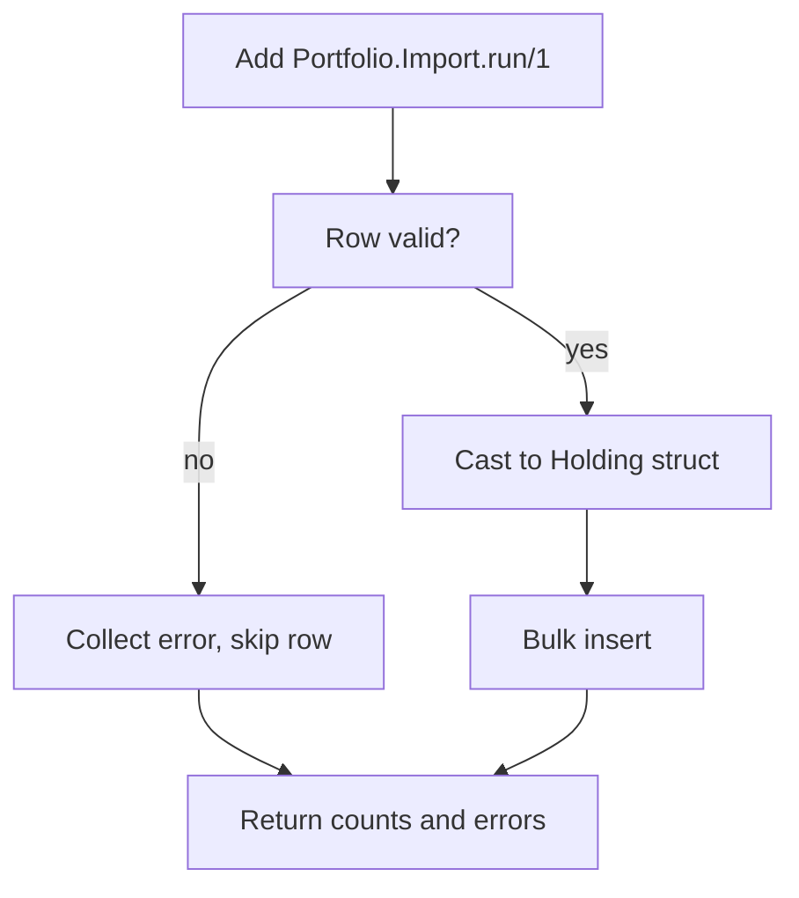

# checkpoint-diagram

A Claude Code plugin that draws one diagram of what changed each time Claude pauses in an auto-accept mode. It appends a Mermaid checkpoint to a per-day log and draws it in your terminal as ASCII, so unattended agent work can be reviewed at a glance.

It does nothing in normal or plan mode. It only fires in an auto-accept permission mode (`acceptEdits`, `bypassPermissions`, `auto`), which is when you are not watching each step.

## How it works

1. A `Stop` hook runs at turn end. If the permission mode is not auto-accept, it exits and does nothing.
2. Trivial turns are skipped: a short final message with a clean working tree produces no diagram.
3. Otherwise the hook blocks the stop once and asks Claude to invoke the `checkpoint-diagram` skill.
4. The skill writes one flowchart to `.claude/checkpoints/<YYYY-MM-DD>.md`, then renders it in the terminal with `mermaid-ascii`.
5. A sentinel file plus the `stop_hook_active` flag prevent any re-trigger loop.

The terminal shows the diagram as ASCII box-art with legible labels. The same file also renders as a full Mermaid diagram in an IDE preview or on GitHub.

## Example

Drawn in the terminal (ASCII, via `mermaid-ascii`):

```
┌──────────────────────────┐
│     Add Import.run/1      │
└────────────┬─────────────┘
             ▼
┌──────────────────────────┐   no
│        Row valid?         ├───────┐
└────────────┬─────────────┘       │
            yes                     ▼
             ▼              ┌────────────────┐
┌──────────────────────┐   │ Collect error  │
│    Cast to struct     │   └────────────────┘
└──────────────────────┘
```

Written to the file (Mermaid, renders on GitHub):



## Install

### As a plugin

```
/plugin marketplace add lucasmsa/claude-checkpoint-diagram
/plugin install checkpoint-diagram@lucasmsa-plugins
```

### Manual

1. Copy `skills/checkpoint-diagram/` to `~/.claude/skills/checkpoint-diagram/`.
2. Copy `hooks/checkpoint-diagram.sh` and `hooks/render-mermaid.sh` to `~/.claude/hooks/` and `chmod +x` both.
3. Add the hook to the `Stop` array in `~/.claude/settings.json`:

```json
{
  "hooks": {
    "Stop": [
      { "hooks": [ { "type": "command", "command": "/absolute/path/to/.claude/hooks/checkpoint-diagram.sh", "timeout": 60 } ] }
    ]
  }
}
```

## Requirements

- `jq`: the Stop hook parses its payload with it.
- `mermaid-ascii`: draws the diagram in the terminal. Install with `go install github.com/AlexanderGrooff/mermaid-ascii@latest`. Without it, checkpoints are still written to file and only the terminal drawing is skipped.
- `git` (optional): a clean working tree is one signal that a turn was trivial.

## Configuration

- **Which modes trigger it.** Edit the `case` statement in `hooks/checkpoint-diagram.sh`. Default set: `acceptEdits`, `bypassPermissions`, `auto`, `dontAsk`.
- **What counts as trivial.** The hook skips when the final message is under 400 characters and the working tree has no changes.
- **Where checkpoints land.** `.claude/checkpoints/<YYYY-MM-DD>.md` in the working directory. Gitignore it.

## Diagram subset

`mermaid-ascii` draws a subset of Mermaid, so the skill keeps diagrams inside it (this also keeps them rendering on GitHub): `flowchart` only, plain `[box]` nodes, ASCII `-->` and `-->|label|` edges, decisions as a labeled box, no `{diamond}` shapes, no `classDef`, no `:::class`.

## Manual use

Run `/checkpoint-diagram` any time to draw a checkpoint for the current turn, regardless of permission mode.

## License

MIT
